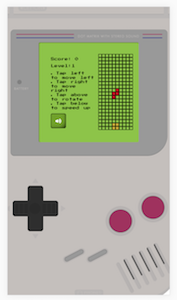
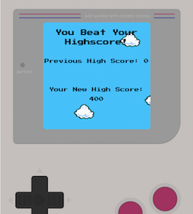
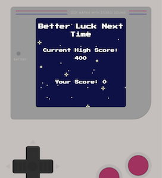

# GA WDI-32 Project 1 - Tetris

For our first project, we were given a week to design and build an in-browser game using HTML, CSS and JavaScript (jQuery library used). After initially struggling to pick a game that was sufficiently challenging to build without being too difficult to complete in the time frame I decided to make a version of Tetris.

##### [Visit website](LINK) for best playing experience (the game has mobile functionality but is best played on desktop).

---

My Tetris remake was initially designed for desktop use but towards the end of the week I added the ability to play on mobile. Whilst on the desktop you use the arrow keys to manipulate the blocks, on mobile the player can tap above the game screen to rotate, left and right to move horizontally and below to speed up the block's fall.

Much like original Tetris, this remake's levels consist only of the speed of the blocks increasing. After every 2000 points earned the interval in the setIntervalTimer function decreases.

The game ends when :
- The player has reached 8000 points
- The stacked blocks touch the top of the game board

At the end of the game the game over screen will display the player's score. I have included a sessional that will store the player's new score if it is higher than the last score stored in the cookie. This information is then displayed in the end screen.

---

I was very pleased with my finished game as I was able to implement a lot more of the original Tetris functionality than I predicted. With more time I planned to add a next shape feature to display the shape of the next block to fall, a hold shape feature to allow the player to save a block to use later, a high score leaderboard, some animations such as when the line clears and improve the mobile version of the game. I would also like to research a better rotation function as well as a better way to randomize the order of blocks.
